## Internet of Things (IoT) Smart Parking System 

The primary problem in modern cities is inefficient parking management due to a lack of real-time information, which causes traffic congestion, wasted fuel, and stress for drivers searching for open spots.

This project provides an IoT Smart Parking solution to fix this. It uses an ESP8266 and an Ultrasonic Sensor (HC-SR04) to automatically detect if a parking slot is occupied or empty. 
 
This status is then instantly sent using the efficient MQTT Protocol to a central server and a Frontend Dashboard. By giving users and operators immediate, accurate visibility of slot availability, the system aims to significantly reduce parking search time and optimize the overall use of the parking area.

### **Table of Contents**

1.  [Project Overview](https://github.com/dendie-sanjaya/iot-parking-lot#1--project-overview)
2.  [Key Features and Technologies](https://github.com/dendie-sanjaya/iot-parking-lot#2--key-features-and-technologies)
3.  [System Architecture (Overall Design)](https://github.com/dendie-sanjaya/iot-parking-lot#3--system-architecture-overall-design)
      * [3.1. Architecture Diagram](https://github.com/dendie-sanjaya/iot-parking-lot#31-architecture-diagram)
4.  [Hardware Components and Wiring](https://github.com/dendie-sanjaya/iot-parking-lot#4--hardware-components-and-wiring)
      * [4.1. Wiring Diagram](https://github.com/dendie-sanjaya/iot-parking-lot#41-wiring-diagram)
5.  [Software Setup and Configuration](https://github.com/dendie-sanjaya/iot-parking-lot#5--software-setup-and-configuration)
      * [5.1. Arduino IDE Setup](https://github.com/dendie-sanjaya/iot-parking-lot#51-arduino-ide-setup)
      * [5.2. Backend/Server Setup](https://github.com/dendie-sanjaya/iot-parking-lot#52-backendserver-setup)
6.  [Application Showcase](https://github.com/dendie-sanjaya/iot-parking-lot#6--application-showcase)
      * [6.1. Simulation Environment](https://github.com/dendie-sanjaya/iot-parking-lot#61-simulation-environment)
      * [6.2. Frontend Dashboard Status](https://github.com/dendie-sanjaya/iot-parking-lot#62-frontend-dashboard-status)
      * [6.3. Backend/Server Log (MQTT and API)](https://github.com/dendie-sanjaya/iot-parking-lot#63-backendserver-log-mqtt-and-api)
7.  [Video Documentation](https://github.com/dendie-sanjaya/iot-parking-lot#7--video-documentation)
8.  [License](https://github.com/dendie-sanjaya/iot-parking-lot#8--license)

### **1. Project Overview**

This project is a detailed simulation of an **Internet of Things (IoT) Smart Parking System** designed to monitor a single parking slot's availability in real-time. It uses the **ESP8266** microcontroller, an **Ultrasonic Sensor (HC-SR04)**, and the **MQTT Protocol** to send status data to a custom-built **Frontend Dashboard**.

This document serves as a complete guide, covering the architecture, hardware setup, software configuration, and a showcase of the running application.

### **2. Key Features and Technologies**

| Feature | Component/Technology | Role in the System |
| :--- | :--- | :--- |
| **Object Sensing** | HC-SR04 Ultrasonic Sensor | **Detects** if a parking slot is **Occupied** (car present) or **Empty** (car absent). |
| **Edge Computing** | ESP8266 Microcontroller | **Processes** sensor data, **Controls** local outputs (LEDs/OLED), and manages **Wi-Fi/MQTT** communication. |
| **Local Status** | LED Lamp (Red/Green) & OLED Display | Provides immediate, local **visual feedback** to the user at the parking slot. |
| **Cloud Communication** | MQTT Protocol (Pub/Sub) | Enables lightweight, **real-time data transmission** of the parking status to the central server. |
| **Backend Data** | SQL Database, Node JS with RESTful API | **Stores** the latest status (`Info Status Slot Parkir`) and serves data to the Frontend Dashboard. |
| **User Interface** | Frontend Dashboard (HTML/JS) | **Monitors** and visualizes the parking slot status centrally in a web browser. |

### **3. System Architecture (Overall Design)**

The system is based on a tiered IoT architecture, defining a clear data flow path from the physical environment to the user interface.

#### **3.1. Architecture Diagram**

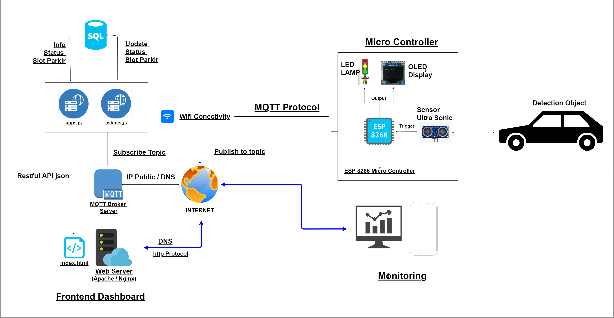

The block diagram below illustrates the three main layers: Micro Controller, Internet/Broker, and Frontend Dashboard/Server.

  * **Micro Controller Layer:** ESP8266 reads the Ultrasonic Sensor, updates the OLED/LED, and **Publishes** data.
  * **Internet Layer:** The ESP8266 connects via **Wi-Fi** to the **MQTT Broker Server** (via IP Public / DNS) and sends the status.
  * **Server Layer:** The **Backend Listener** (`listener.js`) **Subscribes** to the MQTT Topic, updates the **SQL Database** (`Update Status Slot Parkir`), and exposes the data via a **Restful API (JSON)**.
  * **Frontend Layer:** The **Web Server (Apache/Nginx)** hosts the **Dashboard** (`index.html`) which fetches data from the API for **Monitoring**.

### **4. Hardware Components and Wiring**

The following diagram details the pin connections for the ESP8266, sensor, and output modules.

#### **4.1. Wiring Diagram**

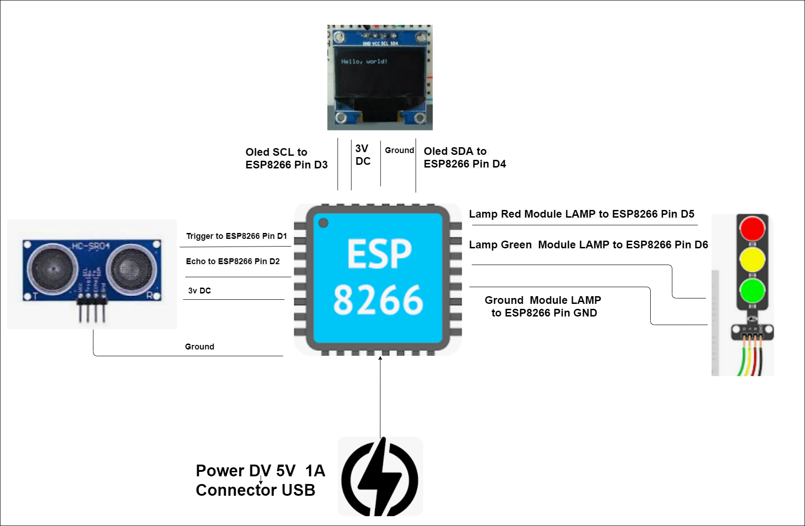

| Component | Pin Function | ESP8266 Pin (NodeMCU) | Notes |
| :--- | :--- | :--- | :--- |
| **HC-SR04 (Sensor)** | Trigger Pin (Output) | **D1 (GPIO 5)** | Output pulse for distance measurement. |
| **HC-SR04 (Sensor)** | Echo Pin (Input) | **D2 (GPIO 4)** | Input pulse for distance calculation. |
| **OLED Display** | SCL (Clock) | **D3 (GPIO 0)** | I2C Communication for display. |
| **OLED Display** | SDA (Data) | **D4 (GPIO 2)** | I2C Communication for display. |
| **Red Lamp Module** | Control Pin | **D5 (GPIO 14)** | Active HIGH/LOW to indicate 'Occupied'. |
| **Green Lamp Module** | Control Pin | **D6 (GPIO 12)** | Active HIGH/LOW to indicate 'Empty'. |
| **Power** | Input | **DV 5V 1A (USB)** | Powers the ESP8266 and all connected components. |

### **5. Software Setup and Configuration**

#### **5.1. Arduino IDE Setup**

Before uploading the firmware, ensure your Arduino IDE is configured correctly.

1.  **Board Manager:** Install the **`esp8266`** boards package.

  

  

  

  

2.  **Required Libraries:** Install the following libraries via the Library Manager:
      * `ESP8266WiFi`
  
  
 
      * `Adafruit SSD1306` (for OLED display)

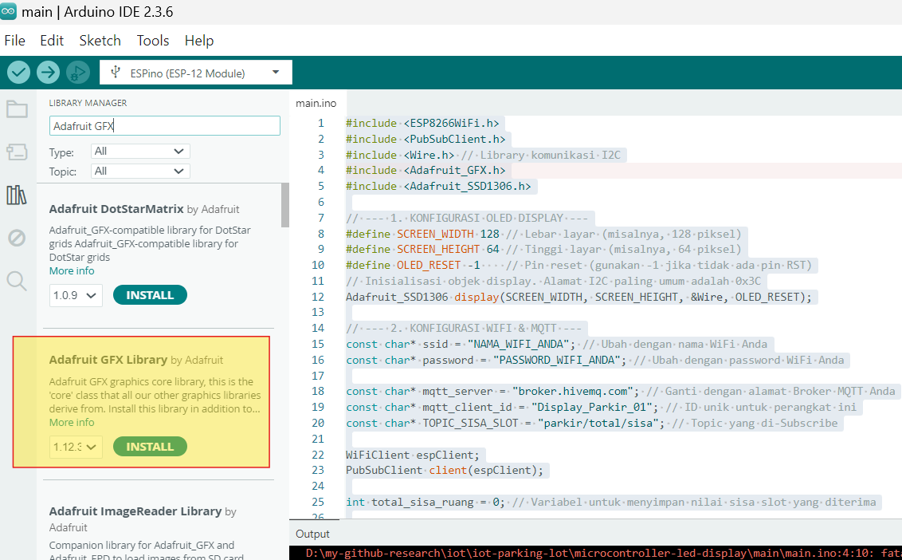  

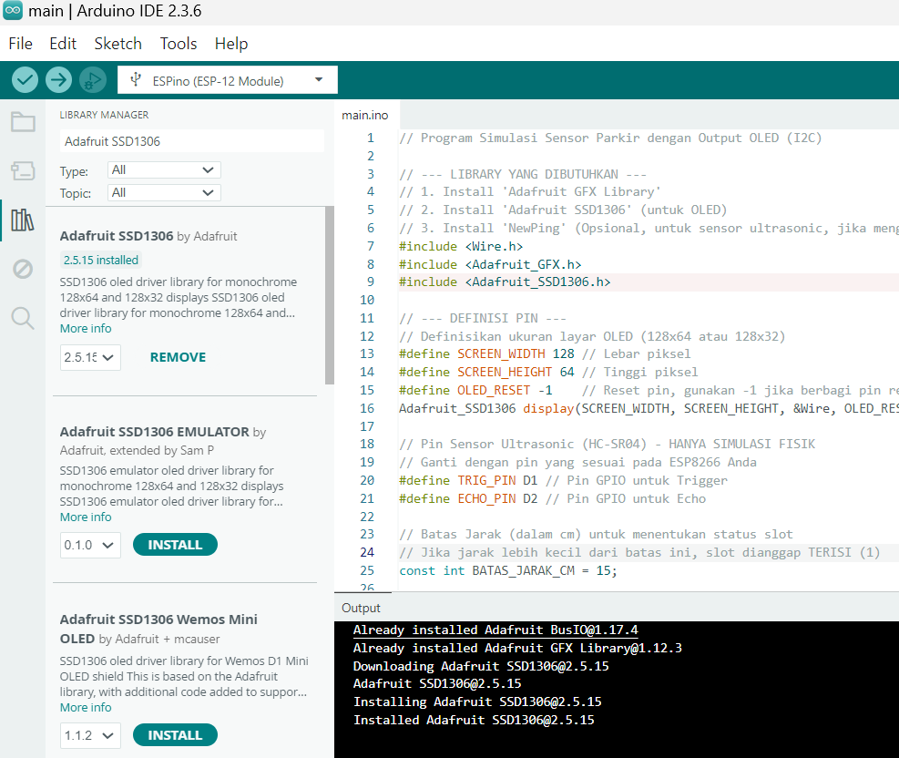  

1.  **Code Configuration:**
      * Set the correct **Wi-Fi credentials** (`SSID` and `PASSWORD`).
      * Configure the **MQTT Broker IP Address/DNS** and **Topic**.

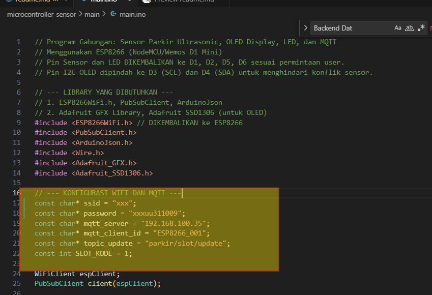

#### **5.2. Backend Server Setup**

1.  **MQTT Broker:** Install and run an MQTT Broker (e.g., Mosquitto). This serves as the communication hub.
   

2.  **Database Setup:** Create the necessary tables in your SQL database to store and manage the parking slot status.
      For this experiment, we are using SQLite database. 

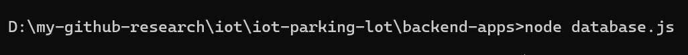

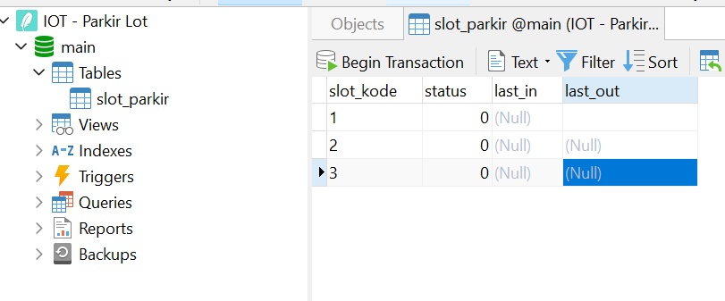

3.  **Deploy Backend:** Deploy the Node.js/other backend files (`listener.js`, `app.js`).
      * The **Listener** must be configured to **Subscribe** to the same MQTT Topic as the ESP8266 **Publishes** to.

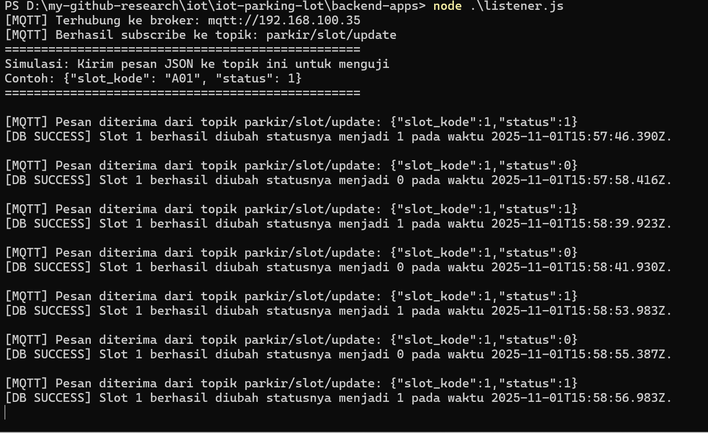

      * The **API** should connect to the SQL Database to serve the current status to the dashboard.

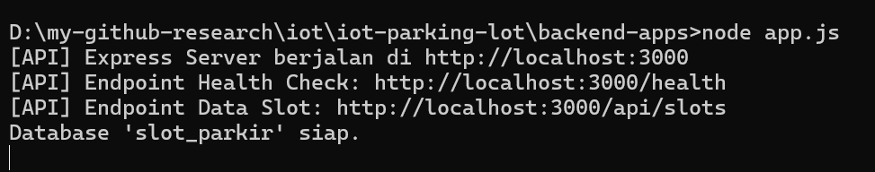

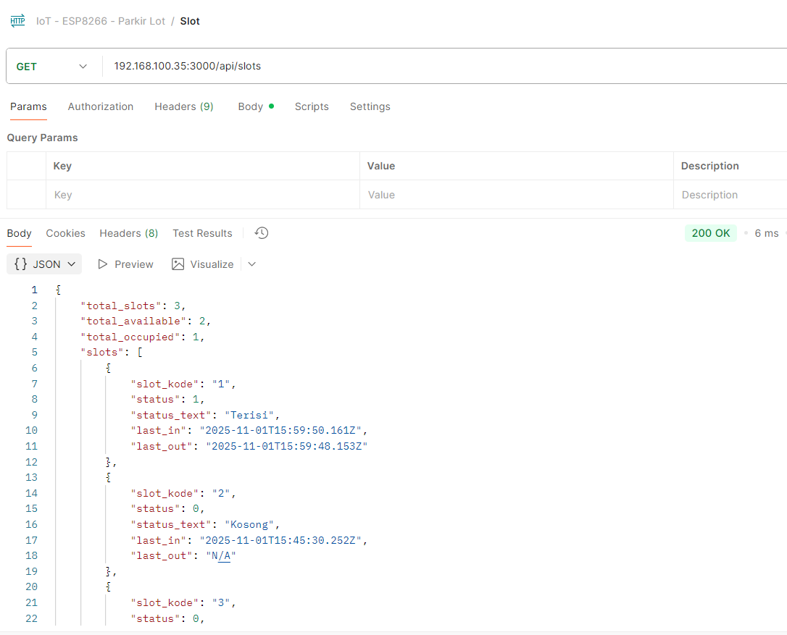

    
4.  **Web Server:** Configure and run your Web Server (Apache/Nginx) to host the Frontend Dashboard files (`index.html`).

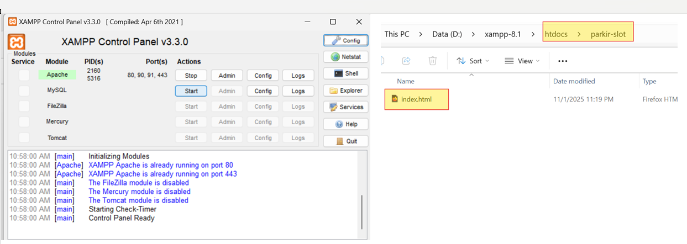

### **6. Application Showcase**

The following *screenshots* demonstrate the successful execution and flow of the application from the hardware simulation to the final dashboard monitoring.

#### **6.1. Simulation Environment**

This visual shows the hardware running, with the sensor detecting a simulated object (car) and the local output indicators (LEDs & OLED) reacting.

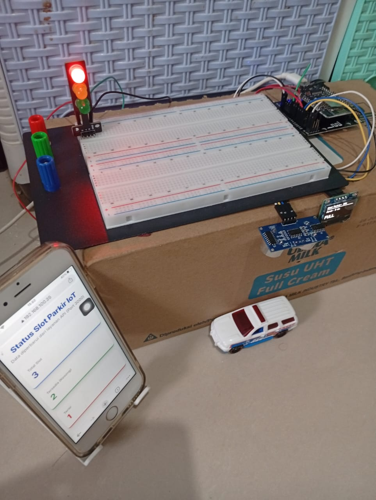

#### **6.2. Frontend Dashboard Status**

This is the final monitoring result displayed to the user/operator. It confirms that data is flowing correctly through the entire system stack (ESP8266 -\> MQTT -\> Listener -\> DB -\> API -\> Dashboard).

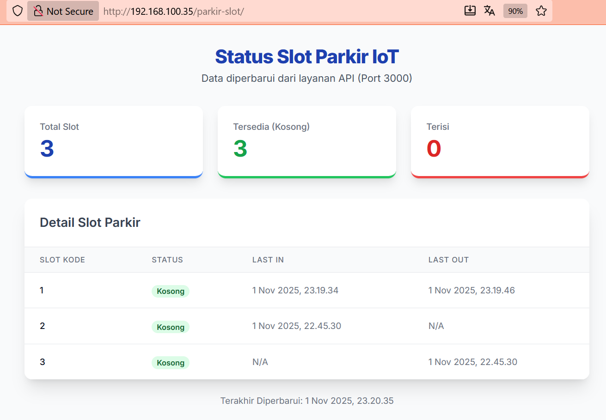

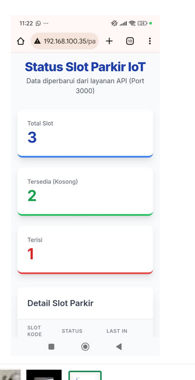

#### **6.3. Backend/Server Log (MQTT and API)**

The server log confirms that the backend listener successfully received the message from the MQTT Broker and processed the database update, showing the data payload.

### **7. Video Documentation**

For a complete, real-time demonstration of the system in action, including the moment a car is detected and the dashboard updates, please watch the following video:

atau

[Download video MP4](video/video.mp4)

